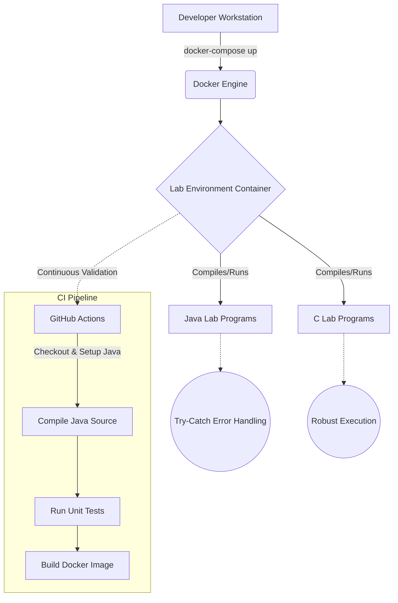

# LAB Repository

This repository is built with strict enterprise engineering standards, focusing on continuous improvement, resilient architecture, graceful error handling, and robust continuous integration.

## 🏗️ System Architecture



## 🚀 Setup Instructions

Follow these step-by-step instructions to get the lab environment running on your local machine.

1. **Ensure Docker is installed**
   Make sure you have Docker and Docker Compose installed on your system.

2. **Clone the repository**
   ```bash
   git clone <repository_url>
   cd LAB
   ```

3. **Start the environment**
   Run the following command to build the Docker image and start the lab container interactively:
   ```bash
   docker-compose run lab-env
   ```
   *Note: If you want to start it in detached mode, use `docker-compose up -d`, but since this is an interactive environment, `run` or `up` with attached stdin is preferred.*

4. **Compile and Run Programs**
   Inside the container, you can navigate to `/app/src/` to compile and run the programs using `javac`, `java`, or `gcc`.

## 📂 Structure

The project has been reorganized to follow a clean, structured layout:

- `/src/`: Contains all the application code, organized by program type (e.g., C, Java).
- `/tests/`: Contains isolated unit tests to validate the correctness of the programs.
- `Dockerfile` & `docker-compose.yml`: Define the containerized development environment.
- `.github/workflows/ci.yml`: Automated CI pipeline to enforce quality standards.

## 🧩 Dependency Rationale

- **Alpine Linux (`alpine:latest`)**: Chosen as the base image for its minimal footprint, significantly reducing the attack surface and image size.
- **OpenJDK 17 (`openjdk17-jdk`)**: Provides a modern, LTS version of the Java compiler and runtime environment needed for the Java lab programs.
- **GCC (`gcc`) & Musl (`musl-dev`)**: Required to compile the C programs natively within the Linux container environment.
- **Docker Compose**: Simplifies the orchestration of the development environment, ensuring all developers have identical setups without complex manual configuration.
